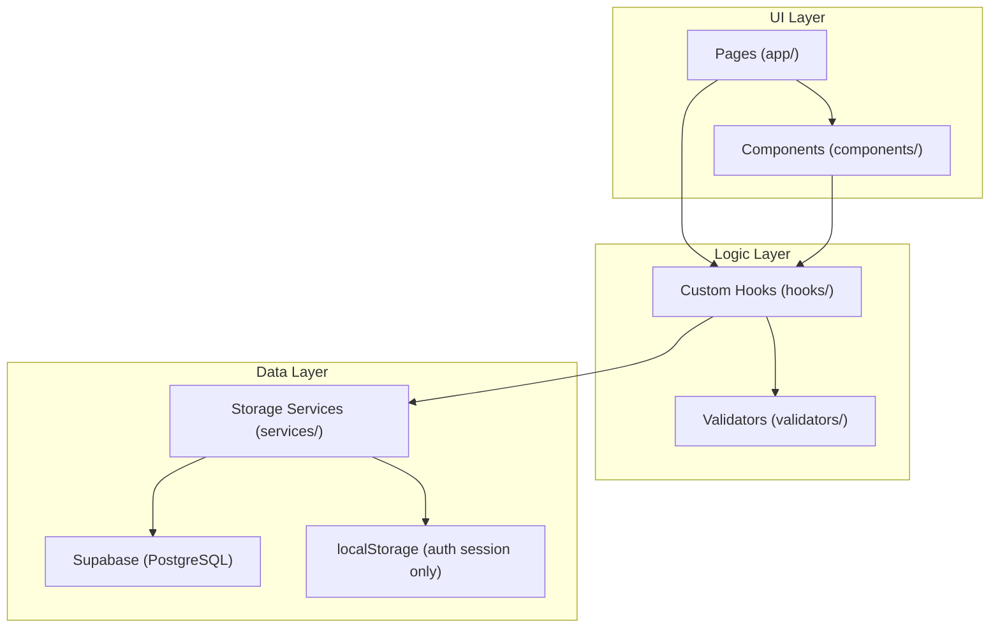
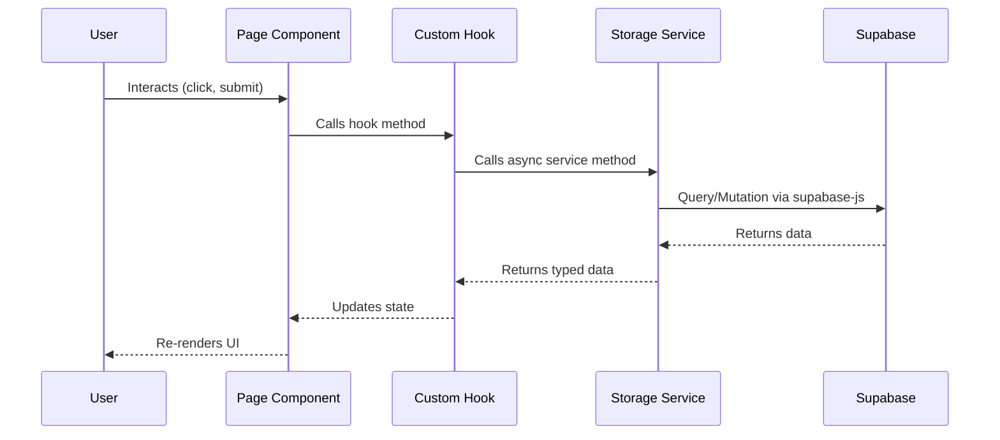

# Employee Leave Management System — Implementation Plan

## Background & Context

Membangun **monolithic web application** menggunakan Next.js App Router untuk mengelola data karyawan dan pengajuan cuti. Awalnya menggunakan Local Storage, aplikasi telah **dimigrasikan ke Supabase (PostgreSQL)** sebagai backend database.

Dokumen referensi:
- [Mini_Project_Specification_Employee_Leave_System.md](file:///C:/AI%20Code/Mini_Project_Specification_Employee_Leave_System.md) — spesifikasi utama
- [AI_Project_Rules.md](file:///C:/AI%20Code/AI_Project_Rules.md) — coding standards & conventions
- [Template_code_review.md](file:///C:/AI%20Code/suplemen/Template_code_review.md) — checklist code review

---

## Technology Stack

| Layer | Technology | Purpose |
|---|---|---|
| Framework | **Next.js 15 (App Router)** | Routing, SSR/CSR, page structure |
| Language | **TypeScript (strict)** | Type safety, ES2022 syntax |
| Styling | **Tailwind CSS 4** | Utility-first CSS framework |
| UI Components | **ShadCN UI** | Pre-built accessible components (Card, Dialog, Table, Toast, Button, Input, Select, etc.) |
| Form Management | **React Hook Form** | Performant form handling |
| Validation | **Zod** | Schema-based validation |
| Data Storage | **Supabase (PostgreSQL)** | Cloud database & auth backend |
| Date Utilities | **date-fns** | Date formatting & manipulation |
| Charts | **Recharts** | Dashboard data visualization |
| Icons | **Lucide React** | SVG icon library |
| Toasts | **Sonner** | Toast notification library |
| Theming | **next-themes** | Light/dark mode support |
| Animations | **Framer Motion** | Page transitions & micro-animations |
| Confetti | **canvas-confetti** | Birthday celebration effects |
| Excel Export | **xlsx + file-saver** | Export data ke file .xlsx |
| Fonts | **Plus Jakarta Sans, Space Grotesk, JetBrains Mono** | Typography (via next/font) |
| ID Generation | **Supabase auto-generated UUIDs** | Unique ID untuk setiap record |
| Deployment | **Vercel** | Hosting & CI/CD via GitHub |

---

## Current Architecture

### Data Flow





---

## Implemented Features

### Phase 1: Project Scaffolding & Foundation ✅

Project diinisialisasi di `C:\AI Code\employee-leave-system\`:

```bash
npx -y create-next-app@latest ./ --typescript --tailwind --eslint --app --src-dir --import-alias "@/*" --use-npm
```

Dependencies tambahan:
```bash
npx -y shadcn@latest init
npm install react-hook-form @hookform/resolvers zod @supabase/supabase-js date-fns recharts sonner next-themes lucide-react
```

ShadCN UI components:
```bash
npx -y shadcn@latest add button card input label select table dialog toast form badge separator dropdown-menu sheet navigation-menu textarea popover calendar tabs avatar scroll-area
```

---

### Phase 2: Type Definitions & Validation Schemas ✅

#### `src/types/employee.ts`

```typescript
export type Employee = {
  id: string;
  name: string;
  department: string;
  position: string;
  phone?: string;
  email?: string;
  hire_date?: string;
  gender?: string;
  birth_date?: string;
  annualLeaveBalance: number;    // Default: 12 days
  blockLeaveTaken: boolean;       // Compliance tracking
  dateOfBirth?: string;
};
```

#### `src/types/leave-request.ts`

```typescript
export type LeaveType = "ANNUAL_LEAVE" | "BLOCK_LEAVE" | "SICK_LEAVE";
export type LeaveStatus = "PENDING" | "APPROVED" | "REJECTED";

export type LeaveRequest = {
  id: string;
  employeeId: string;
  startDate: string;
  endDate: string;
  reason: string;
  type: LeaveType;
  status: LeaveStatus;
  total_days?: number;
  created_at?: string;
};
```

#### `src/types/auth.ts`

```typescript
export type Role = "MANAGER" | "SUPERVISOR" | "EMPLOYEE";

export type AuthSession = {
  username: string;
  role: Role;
  isAuthenticated: boolean;
  loginAt: string;
  userId: string;
};
```

#### `src/types/notification.ts` 🆕

```typescript
export type NotificationType = "ANNOUNCEMENT" | "BIRTHDAY" | "SYSTEM";

export type Notification = {
  id: string;
  title: string;
  message: string;
  type: NotificationType;
  createdBy: string;
  isRead: boolean;
  createdAt: string;
};
```

#### `src/types/user.ts`

```typescript
export type UserRole = "manager" | "supervisor" | "employee";

export type User = {
  id: string;
  username: string;
  password: string;
  full_name: string;
  role: UserRole;
};
```

#### `src/types/broadcast.ts`

```typescript
export type Broadcast = {
  id: string;
  title: string;
  message: string;
  created_at: string;
  created_by: string;
};
```

#### `src/types/birthday-notification.ts`

```typescript
export type BirthdayNotification = {
  id: string;
  employee_id: string;
  notification_date: string;
  is_read: boolean;
};
```

#### `src/types/index.ts`

Barrel export untuk semua types.

---

#### `src/validators/employee-validator.ts` ✅

Zod schema untuk validasi Employee:

| Field | Rule |
|---|---|
| `name` | Required, min 3 characters, trimmed |
| `department` | Required, non-empty |
| `position` | Required, non-empty |
| `phone` | Optional |
| `email` | Optional, valid email format |
| `hire_date` | Optional, valid date format |
| `gender` | Optional |
| `birth_date` | Optional, valid date format |

#### `src/validators/leave-request-validator.ts` ✅

Zod schema untuk validasi Leave Request:

| Field | Rule |
|---|---|
| `employeeId` | Required, non-empty |
| `type` | Required, enum: `ANNUAL_LEAVE`, `BLOCK_LEAVE`, `SICK_LEAVE` |
| `startDate` | Required, valid date format, **cannot fall on 28th-31st** (Tutup Buku) |
| `endDate` | Required, valid date format, **must be > startDate** |
| `reason` | Required, non-empty |

Cross-field validations:
- `endDate > startDate` menggunakan Zod `.refine()`
- Block Leave harus minimal **5 hari berturut-turut**
- Tidak bisa mengambil cuti pada tanggal **28-31** (periode Tutup Buku / month-end closing)

#### `src/validators/login-validator.ts` ✅

Zod schema untuk validasi Login:

| Field | Rule |
|---|---|
| `username` | Required, non-empty |
| `password` | Required, non-empty |

---

### Phase 3: Constants & Utility ✅

#### `src/constants/index.ts`

Berisi konstanta untuk:
- `STORAGE_KEYS` — key untuk localStorage (auth session)
- `DEPARTMENTS` — daftar department predefined
- `POSITIONS` — daftar posisi predefined

#### `src/lib/utils.ts`

Utility functions:
- `cn()` — className merge (dari ShadCN setup)
- `formatDate()` — format tanggal untuk display
- `calculateLeaveDays()` — hitung jumlah hari cuti

#### `src/lib/supabase.ts`

Supabase client dengan **lazy initialization** (menggunakan Proxy pattern) untuk menghindari crash saat build/prerender di Vercel:

```typescript
import { createClient, SupabaseClient } from "@supabase/supabase-js";

let _supabase: SupabaseClient | null = null;

export function getSupabase(): SupabaseClient {
  if (!_supabase) {
    const supabaseUrl = process.env.NEXT_PUBLIC_SUPABASE_URL;
    const supabaseAnonKey = process.env.NEXT_PUBLIC_SUPABASE_ANON_KEY;
    if (!supabaseUrl || !supabaseAnonKey) {
      throw new Error("Missing Supabase environment variables.");
    }
    _supabase = createClient(supabaseUrl, supabaseAnonKey);
  }
  return _supabase;
}

export const supabase = new Proxy({} as SupabaseClient, {
  get(_target, prop) {
    return (getSupabase() as unknown as Record<string | symbol, unknown>)[prop];
  },
});
```

---

### Phase 4: Service Layer (Supabase Abstraction) ✅

> [!IMPORTANT]
> Semua service methods sekarang **async** dan mengembalikan `Promise<...>`.

#### `src/services/employee-storage.ts`

Class `EmployeeStorageService` dengan static async methods:

| Method | Signature | Description |
|---|---|---|
| `getAll()` | `() => Promise<Employee[]>` | Ambil semua employees dari Supabase |
| `getById()` | `(id: string) => Promise<Employee \| undefined>` | Ambil satu employee by ID |
| `create()` | `(data: Omit<Employee, "id">) => Promise<Employee>` | Buat employee baru |
| `update()` | `(id: string, data: Partial<Omit<Employee, "id">>) => Promise<Employee>` | Update employee |
| `delete()` | `(id: string) => Promise<void>` | Hapus employee (cascade leave requests) |
| `search()` | `(query: string) => Promise<Employee[]>` | Cari employee by name (ilike) |

#### `src/services/leave-storage.ts`

Class `LeaveStorageService` dengan static async methods:

| Method | Signature | Description |
|---|---|---|
| `getAll()` | `() => Promise<LeaveRequest[]>` | Ambil semua leave requests |
| `getById()` | `(id: string) => Promise<LeaveRequest \| undefined>` | Ambil satu leave request by ID |
| `create()` | `(data: ...) => Promise<LeaveRequest>` | Buat leave request baru, default `PENDING` |
| `approve()` | `(id: string) => Promise<LeaveRequest>` | Update status ke `APPROVED` |
| `reject()` | `(id: string) => Promise<LeaveRequest>` | Update status ke `REJECTED` |
| `getByStatus()` | `(status: LeaveStatus) => Promise<LeaveRequest[]>` | Filter by status |
| `getByEmployee()` | `(employeeId: string) => Promise<LeaveRequest[]>` | Filter by employee |
| `delete()` | `(id: string) => Promise<void>` | Hapus leave request |

#### `src/services/auth-storage.ts`

Class `AuthStorageService` dengan static methods:

| Method | Signature | Description |
|---|---|---|
| `login()` | `(username: string, password: string) => Promise<boolean>` | Validasi credentials via Supabase `users` table, simpan session ke localStorage |
| `logout()` | `() => void` | Hapus session dari localStorage |
| `getSession()` | `() => AuthSession \| null` | Ambil current session dari localStorage |
| `isAuthenticated()` | `() => boolean` | Cek apakah user sudah login |

#### `src/services/broadcast-storage.ts` 🆕

Class `BroadcastStorageService` — CRUD untuk broadcasts via Supabase `broadcasts` table.

#### `src/services/birthday-notification-storage.ts` 🆕

Class `BirthdayNotificationStorageService` — Manages birthday notification read state via Supabase `birthday_notifications` table.

---

### Phase 5: Custom Hooks ✅

#### `src/hooks/useAuth.ts`
- `isAuthenticated` state
- `login(username, password)` — async, calls `AuthStorageService.login()`
- `logout()` — calls `AuthStorageService.logout()` + redirect ke `/login`
- Auto-check session on mount

#### `src/hooks/useEmployees.ts`
- `employees` state, `loading` state
- Async CRUD operations via `EmployeeStorageService`

#### `src/hooks/useLeaveRequests.ts`
- `leaveRequests` state, `loading` state
- Status filter, async CRUD via `LeaveStorageService`

#### `src/hooks/useDashboard.ts`
- Dashboard statistics (counts + chart data)
- Data dari Supabase via services

---

### Phase 6: Shared Components ✅

| Component | File | Description |
|---|---|---|
| AppLayout | `src/components/shared/AppLayout.tsx` | Sidebar navigation (desktop) + Sheet menu (mobile), **role-based nav filtering** |
| AuthGuard | `src/components/shared/AuthGuard.tsx` | Client-side auth protection |
| PageHeader | `src/components/shared/PageHeader.tsx` | Reusable page header with title, description, actions |
| ConfirmDialog | `src/components/shared/ConfirmDialog.tsx` | Reusable confirmation dialog (destructive variant) |
| EmptyState | `src/components/shared/EmptyState.tsx` | Empty state with icon, title, description, action |
| StatusBadge | `src/components/shared/StatusBadge.tsx` | Leave status badge (PENDING/APPROVED/REJECTED) |
| SearchInput | `src/components/shared/SearchInput.tsx` | Debounced search input |
| NotificationDropdown | `src/components/shared/NotificationDropdown.tsx` | 🆕 Bell icon dropdown showing unread notifications |
| ThemeToggle | `src/components/shared/ThemeToggle.tsx` | 🆕 Dark/light mode toggle |
| AnimatedCounter | `src/components/shared/AnimatedCounter.tsx` | 🆕 Number counter animation |
| DateRangeFilter | `src/components/shared/DateRangeFilter.tsx` | 🆕 Date range filter for dashboard charts |
| FadeIn | `src/components/shared/FadeIn.tsx` | 🆕 Framer Motion fade-in animation wrapper |
| StaggerContainer | `src/components/shared/StaggerContainer.tsx` | 🆕 Staggered animation wrapper |
| Skeleton | `src/components/shared/Skeleton.tsx` | 🆕 Loading skeleton component |

---

### Phase 7: Authentication Module ✅

#### `src/app/login/page.tsx` — Route: `/login`

Fitur:
- Form login dengan React Hook Form + Zod validation
- Validasi credentials terhadap Supabase `users` table
- Support 3 demo accounts (ditampilkan di halaman login):
  - Manager: `admin` / `admin123`
  - Supervisor: `hikari` / `hikari123`
  - Employee: `haikal` / `haikal123`
- Jika success → redirect ke `/dashboard`
- Jika sudah login → auto-redirect ke `/dashboard`

UI Design:
- Split layout: Corporate branding (left) + Login form (right)
- Responsive: full-width form di mobile, branding hidden
- Modern design dengan gradient background & glassmorphism accents

#### `src/components/shared/AuthGuard.tsx`

Client-side auth guard — wrap semua protected routes, redirect ke `/login` jika belum authenticated.

---

### Phase 8: Dashboard Module ✅

#### `src/app/(protected)/dashboard/page.tsx` — Route: `/dashboard`

#### Dashboard Components:

| Component | File | Description |
|---|---|---|
| DashboardStatsCard | `src/components/dashboard/DashboardStatsCard.tsx` | Individual stat card dengan icon & warna |
| DashboardGrid | `src/components/dashboard/DashboardGrid.tsx` | Grid layout untuk stat cards |
| DepartmentChart | `src/components/dashboard/DepartmentChart.tsx` | 🆕 Department distribution chart |
| LeaveStatusChart | `src/components/dashboard/LeaveStatusChart.tsx` | 🆕 Leave status breakdown chart |
| LeaveTypeBreakdownChart | `src/components/dashboard/LeaveTypeBreakdownChart.tsx` | 🆕 Leave type breakdown chart |
| LeavesTrendChart | `src/components/dashboard/LeavesTrendChart.tsx` | 🆕 Leave trend over time chart |
| RecentLeaveRequests | `src/components/dashboard/RecentLeaveRequests.tsx` | 🆕 Recent leave request list |

Stats cards:
- **Total Employees** — icon: Users, color: blue
- **Pending Leave Requests** — icon: Clock, color: amber
- **Approved Leave Requests** — icon: CheckCircle, color: green
- **Rejected Leave Requests** — icon: XCircle, color: red
- **Non-Compliant Block Leave** — 🆕 Compliance tracking
- **My Leave Balance** — 🆕 Personal remaining balance (role-scoped)

> [!NOTE]
> Dashboard data is role-scoped: EMPLOYEE/SUPERVISOR only see their own data. MANAGER sees all.

---

### Phase 9: Employee Management Module ✅

#### `src/app/(protected)/employees/page.tsx` — Route: `/employees`
- Page header + "Add Employee" button
- Search bar (search by name via Supabase `ilike`)
- Employee table + empty state

#### `src/components/employee/EmployeeTable.tsx`

| Column | Description |
|---|---|
| Name | Nama employee |
| Department | Department |
| Position | Posisi |
| Phone | Nomor telepon |
| Email | Email |
| Actions | Edit, Delete buttons |

#### `src/components/employee/EmployeeForm.tsx`

Reusable form (create & edit):

| Field | Type | Validation |
|---|---|---|
| Name | Text Input | Required, min 3 chars |
| Department | Select | Required |
| Position | Select | Required |
| Phone | Text Input | Optional |
| Email | Text Input | Optional, valid email |
| Gender | Select | Optional |
| Hire Date | Date Input | Optional |
| Birth Date | Date Input | Optional |

#### `src/app/(protected)/employees/new/page.tsx` — Route: `/employees/new`
#### `src/app/(protected)/employees/edit/[id]/page.tsx` — Route: `/employees/edit/[id]`

---

### Phase 10: Leave Request Module ✅

#### `src/app/(protected)/leave/page.tsx` — Route: `/leave`
- Page header + "New Request" button
- Filter by status (All, Pending, Approved, Rejected)
- Leave request table + empty state

#### `src/components/leave/LeaveRequestTable.tsx`

| Column | Description |
|---|---|
| Employee Name | Resolved dari employeeId |
| Start Date | Formatted date |
| End Date | Formatted date |
| Duration | Calculated days |
| Reason | Alasan cuti |
| Status | StatusBadge component |
| Actions | Approve/Reject (hanya PENDING) |

#### `src/components/leave/LeaveRequestForm.tsx`

| Field | Type | Validation |
|---|---|---|
| Employee | Select dropdown | Required |
| Leave Type | Select (Annual/Block/Sick) | Required |
| Start Date | Date picker | Required, cannot be 28th-31st |
| End Date | Date picker | Required, > Start Date |
| Reason | Textarea | Required |

> [!IMPORTANT]
> **Block Leave** harus minimal 5 hari berturut-turut. **Tutup Buku** (28th-31st) tidak bisa dipilih sebagai tanggal cuti.

#### `src/app/(protected)/leave/new/page.tsx` — Route: `/leave/new`

---

### Phase 11: Birthday Module 🆕

#### `src/app/(protected)/birthdays/page.tsx` — Route: `/birthdays`

Fitur:
- Calendar view employee birthdays
- List view upcoming birthdays
- Birthday notification bell (di navigation)

#### Birthday Components:

| Component | File | Description |
|---|---|---|
| BirthdayCalendar | `src/components/birthday/BirthdayCalendar.tsx` | Calendar view |
| BirthdayList | `src/components/birthday/BirthdayList.tsx` | Upcoming birthdays list |
| BirthdayNotificationBell | `src/components/birthday/BirthdayNotificationBell.tsx` | Notification bell icon |

#### Service: `src/services/birthday-notification-storage.ts`
- Track birthday notifications via Supabase `birthday_notifications` table

---

### Phase 12: Broadcast Module 🆕

#### `src/app/(protected)/broadcast/page.tsx` — Route: `/broadcast`

Fitur:
- Create and send company-wide broadcast messages
- View list of sent broadcasts

#### Broadcast Components:

| Component | File | Description |
|---|---|---|
| BroadcastForm | `src/components/broadcast/BroadcastForm.tsx` | Form to create broadcasts |
| BroadcastList | `src/components/broadcast/BroadcastList.tsx` | List of sent broadcasts |

#### Service: `src/services/broadcast-storage.ts`
- CRUD for broadcasts via Supabase `broadcasts` table

---

### Phase 13: Code Review Page 🆕

#### `src/app/code-review/page.tsx` — Route: `/code-review` (public)

Halaman publik (tanpa login) untuk menampilkan laporan code review. Data dari `CODE_REVIEW_REPORT.md`.
- Server-side rendered — reads markdown from disk
- Includes severity chart visualization
- Has link to login page

#### Component: `src/components/code-review/CodeReviewContent.tsx`

---

### Phase 15: Excel Export 🆕

#### `src/lib/export-excel.ts`

Functions to export data ke file `.xlsx`:
- Export daftar employees
- Export daftar leave requests
- Uses `xlsx` + `file-saver` packages

---

### Phase 16: Notification System 🆕

#### `src/services/notification-service.ts`

Class `NotificationService` — CRUD for notifications via Supabase:

| Method | Description |
|---|---|
| `getAll()` | Ambil semua notifications |
| `getUnread()` | Ambil notifications yang belum dibaca |
| `create()` | Buat notification baru |
| `markAsRead()` | Tandai satu notification sebagai dibaca |
| `markAllAsRead()` | Tandai semua notifications sebagai dibaca |
| `delete()` | Hapus notification |

---

### Phase 17: Route Structure & Navigation ✅

#### `src/app/(protected)/layout.tsx`

Protected route group layout:
- Wrap dengan `AuthGuard`
- Include `AppLayout` (sidebar navigation)
- `export const dynamic = "force-dynamic"` — prevent prerendering saat build

#### Route Structure:

```
src/app/
├── login/page.tsx                      (public)
├── page.tsx                            (redirect)
├── layout.tsx                          (root layout)
├── code-review/page.tsx                (public)  🆕
└── (protected)/
    ├── layout.tsx                      (auth guard + app layout + force-dynamic)
    ├── dashboard/page.tsx
    ├── employees/
    │   ├── page.tsx
    │   ├── new/page.tsx
    │   └── edit/[id]/page.tsx
    ├── leave/
    │   ├── page.tsx
    │   └── new/page.tsx
    ├── birthdays/page.tsx              🆕
    └── broadcast/page.tsx              🆕
```

---

## Complete File Tree

```
employee-leave-system/
├── src/
│   ├── app/
│   │   ├── globals.css
│   │   ├── layout.tsx                           # Root layout (fonts, Toaster, metadata)
│   │   ├── page.tsx                             # Root redirect
│   │   ├── login/
│   │   │   └── page.tsx                         # Login page
│   │   ├── code-review/
│   │   │   └── page.tsx                         # Public code review page  🆕
│   │   └── (protected)/
│   │       ├── layout.tsx                       # AuthGuard + AppLayout + force-dynamic
│   │       ├── dashboard/
│   │       │   └── page.tsx                     # Dashboard page
│   │       ├── employees/
│   │       │   ├── page.tsx                     # Employee list page
│   │       │   ├── new/
│   │       │   │   └── page.tsx                 # Create employee page
│   │       │   └── edit/
│   │       │       └── [id]/
│   │       │           └── page.tsx             # Edit employee page
│   │       ├── leave/
│   │       │   ├── page.tsx                     # Leave request list page
│   │       │   └── new/
│   │       │       └── page.tsx                 # Create leave request page
│   │       ├── birthdays/
│   │       │   └── page.tsx                     # Birthday tracking page  🆕
│   │       └── broadcast/
│   │           └── page.tsx                     # Broadcast page  🆕
│   │
│   ├── components/
│   │   ├── ui/                                  # ShadCN UI components (auto-generated)
│   │   │   ├── button.tsx
│   │   │   ├── card.tsx
│   │   │   ├── dialog.tsx
│   │   │   ├── input.tsx
│   │   │   ├── label.tsx
│   │   │   ├── select.tsx
│   │   │   ├── table.tsx
│   │   │   ├── toast.tsx
│   │   │   ├── toaster.tsx
│   │   │   ├── badge.tsx
│   │   │   ├── form.tsx
│   │   │   ├── separator.tsx
│   │   │   ├── dropdown-menu.tsx
│   │   │   ├── sheet.tsx
│   │   │   ├── textarea.tsx
│   │   │   ├── popover.tsx
│   │   │   ├── calendar.tsx
│   │   │   ├── tabs.tsx
│   │   │   ├── avatar.tsx
│   │   │   └── scroll-area.tsx
│   │   ├── shared/
│   │   │   ├── AppLayout.tsx                    # Main layout with sidebar navigation
│   │   │   ├── AuthGuard.tsx                    # Client-side auth protection
│   │   │   ├── PageHeader.tsx                   # Reusable page header
│   │   │   ├── ConfirmDialog.tsx                # Reusable confirmation dialog
│   │   │   ├── EmptyState.tsx                   # Empty state component
│   │   │   ├── StatusBadge.tsx                  # Leave status badge
│   │   │   └── SearchInput.tsx                  # Debounced search input
│   │   ├── dashboard/
│   │   │   ├── DashboardStatsCard.tsx           # Individual stat card
│   │   │   ├── DashboardGrid.tsx                # Stats grid layout
│   │   │   ├── DashboardCharts.tsx              # Data visualization  🆕
│   │   │   └── RecentLeaveRequests.tsx          # Recent requests list  🆕
│   │   ├── employee/
│   │   │   ├── EmployeeTable.tsx                # Employee data table
│   │   │   ├── EmployeeForm.tsx                 # Create/Edit employee form
│   │   │   └── EmployeeSearch.tsx               # Employee search bar
│   │   ├── leave/
│   │   │   ├── LeaveRequestTable.tsx            # Leave request data table
│   │   │   ├── LeaveRequestForm.tsx             # Create leave request form
│   │   │   └── LeaveRequestFilter.tsx           # Status filter tabs
│   │   ├── birthday/                            # 🆕
│   │   │   ├── BirthdayCalendar.tsx             # Calendar view
│   │   │   ├── BirthdayList.tsx                 # Upcoming birthdays list
│   │   │   └── BirthdayNotificationBell.tsx     # Notification bell
│   │   ├── broadcast/                           # 🆕
│   │   │   ├── BroadcastForm.tsx                # Create broadcast form
│   │   │   └── BroadcastList.tsx                # Broadcast history list
│   │   └── code-review/                         # 🆕
│   │       └── CodeReviewContent.tsx            # Code review report renderer
│   │
│   ├── services/
│   │   ├── auth-storage.ts                      # Auth session management (Supabase + localStorage)
│   │   ├── employee-storage.ts                  # Employee CRUD via Supabase
│   │   ├── leave-storage.ts                     # Leave request CRUD via Supabase
│   │   ├── broadcast-storage.ts                 # Broadcast CRUD via Supabase  🆕
│   │   └── birthday-notification-storage.ts     # Birthday notifications via Supabase  🆕
│   │
│   ├── types/
│   │   ├── index.ts                             # Barrel export
│   │   ├── employee.ts                          # Employee type (extended fields)
│   │   ├── leave-request.ts                     # LeaveRequest & LeaveStatus types
│   │   ├── auth.ts                              # AuthSession type (with role)
│   │   ├── user.ts                              # User & UserRole types  🆕
│   │   ├── broadcast.ts                         # Broadcast type  🆕
│   │   └── birthday-notification.ts             # BirthdayNotification type  🆕
│   │
│   ├── validators/
│   │   ├── employee-validator.ts                # Zod schema for Employee
│   │   ├── leave-request-validator.ts           # Zod schema for LeaveRequest
│   │   └── login-validator.ts                   # Zod schema for Login
│   │
│   ├── hooks/
│   │   ├── useAuth.ts                           # Auth state management
│   │   ├── useEmployees.ts                      # Employee data management
│   │   ├── useLeaveRequests.ts                  # Leave request management
│   │   └── useDashboard.ts                      # Dashboard statistics
│   │
│   ├── constants/
│   │   └── index.ts                             # App-wide constants
│   │
│   └── lib/
│       ├── utils.ts                             # Utility functions (cn, formatDate, etc.)
│       └── supabase.ts                          # Supabase client (lazy initialization)
│
├── supabase/
│   └── config.toml                              # Supabase project configuration
│
├── public/
├── package.json
├── tsconfig.json
├── next.config.ts
├── components.json                              # ShadCN configuration
├── supabase_setup.sql                           # Main DB schema & seed data
├── fix_rls.sql                                  # RLS policy fixes
├── migration_birthday_notifications.sql         # Birthday feature migration
└── CODE_REVIEW_REPORT.md                        # Code review report
```

---

## Database Schema (Supabase)

### Tables

#### `users`
| Column | Type | Description |
|---|---|---|
| id | uuid (PK) | Auto-generated |
| username | text | Login username |
| password | text | Login password |
| full_name | text | Display name |
| role | text | `manager` / `supervisor` / `employee` |

#### `employees`
| Column | Type | Description |
|---|---|---|
| id | uuid (PK) | Auto-generated |
| name | text | Employee name |
| department | text | Department |
| position | text | Position/role |
| phone | text | Phone number (optional) |
| email | text | Email (optional) |
| hire_date | date | Hire date (optional) |
| gender | text | Gender (optional) |
| birth_date | date | Birth date (optional) |

#### `leave_requests`
| Column | Type | Description |
|---|---|---|
| id | uuid (PK) | Auto-generated |
| employee_id | uuid (FK) | References employees.id |
| start_date | date | Leave start date |
| end_date | date | Leave end date |
| reason | text | Leave reason |
| status | text | `PENDING` / `APPROVED` / `REJECTED` |
| total_days | integer | Calculated leave duration |
| created_at | timestamptz | Auto-generated timestamp |

#### `broadcasts`
| Column | Type | Description |
|---|---|---|
| id | uuid (PK) | Auto-generated |
| title | text | Broadcast title |
| message | text | Broadcast message body |
| created_at | timestamptz | Auto-generated timestamp |
| created_by | text | Username of sender |

#### `birthday_notifications`
| Column | Type | Description |
|---|---|---|
| id | uuid (PK) | Auto-generated |
| employee_id | uuid (FK) | References employees.id |
| notification_date | date | Date of notification |
| is_read | boolean | Read status |

### Seed Data (Demo)

3 demo user accounts:
- `admin` / `admin123` — role: **manager**
- `hikari` / `hikari123` — role: **supervisor**
- `haikal` / `haikal123` — role: **employee**

Sample employees and leave requests included in `supabase_setup.sql`.

---

## Key Business Rules

### Authentication & RBAC
1. Credentials validated against Supabase `app_users` table
2. Session disimpan di localStorage sebagai JSON (client-side state)
3. **Role-Based Access Control** — 3 roles:
   - **MANAGER**: Full access, can broadcast, see all data
   - **SUPERVISOR**: Limited admin access, scoped data
   - **EMPLOYEE**: Self-service only, scoped to own data
4. Navigation items filtered berdasarkan role
5. Dashboard data scoped by role
6. Semua route kecuali `/login` dan `/code-review` memerlukan authentication
7. Logout menghapus session + redirect ke `/login`

> [!WARNING]
> **Security Note**: Passwords disimpan sebagai plaintext di database (`password_hash` column name misleading). RLS policies mengizinkan `anon` role full CRUD access. Ini hanya cocok untuk demo/development.

### Employee Management
1. ID di-generate otomatis oleh Supabase
2. Name minimal 3 karakter
3. Department dan Position wajib (dropdown dari predefined list)
4. Extended fields: phone, email, hire_date, gender, birth_date
5. **Annual Leave Balance**: Default 12 hari per karyawan
6. **Block Leave Compliance**: Tracking apakah karyawan sudah mengambil block leave
7. Search employee berdasarkan name (case-insensitive, Supabase `ilike`)
8. Delete employee → cascade delete related leave requests

### Leave Request Management
1. Status awal selalu `PENDING`
2. **3 jenis cuti**: Annual Leave, Block Leave, Sick Leave
3. `endDate` harus > `startDate`
4. Employee dipilih dari dropdown (data dari Supabase)
5. Hanya request `PENDING` yang bisa di-approve/reject
6. Approve/Reject membutuhkan konfirmasi
7. **Approval mengurangi annual leave balance** karyawan
8. Tidak ada edit leave request (hanya create, approve, reject)

### Banking-Specific Rules (BNI) 🆕
1. **Mandatory Block Leave**: Setiap karyawan wajib mengambil block leave minimal 5 hari berturut-turut
2. **Blackout Dates (Tutup Buku)**: Tidak bisa mengambil cuti pada tanggal 28-31 setiap bulan (periode tutup buku)
3. **Leave Quota**: Annual leave balance 12 hari, dikurangi saat approval
4. **Non-Compliant Tracking**: Dashboard menampilkan jumlah karyawan yang belum mengambil block leave

### Birthday Tracking
1. Employee birth_date / dateOfBirth optional
2. Calendar view untuk melihat birthdays
3. 3 sections: Today's birthdays (with confetti), Upcoming (30 days), Later
4. Notification bell untuk today's birthdays
5. Notification read state tracked di Supabase

### Broadcasts & Notifications
1. **Manager only** bisa membuat broadcast (non-MANAGER redirected ke dashboard)
2. Broadcast creates entries di `notifications` table
3. Semua user bisa melihat notifications via bell dropdown
4. Mark as read / mark all as read functionality
5. Sorted by created_at descending

---

## Deployment Configuration

### Vercel Deployment

#### Environment Variables (wajib di-set di Vercel Dashboard):
| Variable | Description |
|---|---|
| `NEXT_PUBLIC_SUPABASE_URL` | Supabase project URL |
| `NEXT_PUBLIC_SUPABASE_ANON_KEY` | Supabase anonymous key |

#### Build Fixes Applied:
1. **Lazy Supabase initialization** (`src/lib/supabase.ts`) — Proxy pattern agar Supabase client hanya dibuat saat runtime, bukan saat build/prerender
2. **Force-dynamic rendering** (`src/app/(protected)/layout.tsx`) — `export const dynamic = "force-dynamic"` mencegah prerendering halaman protected yang membutuhkan env vars
3. **Build output** — Halaman protected di-render sebagai `ƒ (Dynamic)`, halaman publik sebagai `○ (Static)`

#### Build Output:
```
Route (app)                                    Size    First Load JS
┌ ○ /                                          189 B          126 kB
├ ○ /_not-found                                978 B          113 kB
├ ƒ /(protected)/birthdays                     47.6 kB        210 kB
├ ƒ /(protected)/broadcast                     4.17 kB        210 kB
├ ƒ /(protected)/dashboard                     47 kB          210 kB
├ ƒ /(protected)/employees                     62.3 kB        225 kB
├ ƒ /(protected)/employees/edit/[id]           30.1 kB        193 kB
├ ƒ /(protected)/employees/new                 30 kB          192 kB
├ ƒ /(protected)/leave                         50.2 kB        213 kB
├ ƒ /(protected)/leave/new                     25 kB          187 kB
├ ○ /code-review                               107 kB         219 kB
└ ○ /login                                     14.5 kB        138 kB

○  (Static)   prerendered as static content
ƒ  (Dynamic)  server-rendered on demand
```

---

## UI/UX Design Decisions

### Color Palette (Dark Theme)
- Background: Slate/Zinc dark tones
- Primary accent: Indigo/Blue gradient
- Success: Emerald green
- Warning: Amber
- Danger: Rose/Red
- Cards: Glass-morphism effect dengan subtle border

### Navigation
- **Desktop**: Collapsible sidebar di kiri, sticky
- **Mobile**: Sheet-based overlay navigation (hamburger menu)
- Active route highlighting
- Icons untuk setiap menu item (Lucide icons)
- Birthday notification bell di navigation bar

### Micro-interactions
- Hover effects pada cards dan table rows
- Smooth page transitions
- Toast notifications (Sonner) slide-in
- Loading skeletons saat initial data load
- Button loading state (spinner + disabled)

### Responsiveness
- Mobile-first approach
- Breakpoints: `sm` (640px), `md` (768px), `lg` (1024px)
- Tables → horizontal scroll atau card view di mobile
- Form layouts → single column di mobile, two-column di desktop

---

## Verification Plan

### Automated Verification

```bash
# TypeScript compilation check
npx tsc --noEmit

# ESLint check
npm run lint

# Build test (should complete without errors)
npm run build
```

### Manual Verification

| Test Case | Expected Result |
|---|---|
| Open `/login` — enter wrong credentials | Error toast muncul |
| Open `/login` — enter `admin`/`admin123` | Redirect ke `/dashboard` |
| Login as `hikari`/`hikari123` | Login sebagai supervisor |
| Login as `haikal`/`haikal123` | Login sebagai employee |
| Dashboard — check counters | Angka sesuai data di Supabase |
| Dashboard — check charts | Charts render dengan data |
| Create employee — submit empty form | Validation errors muncul |
| Create employee — name < 3 chars | Validation error: minimum 3 characters |
| Create employee — valid data | Success toast + redirect ke list |
| Search employee by name | Table filtered sesuai query |
| Edit employee — load existing data | Form pre-filled |
| Delete employee | Confirmation dialog → deleted → toast |
| Create leave request — endDate < startDate | Validation error |
| Create leave request — valid data | Success toast + redirect + status PENDING |
| Approve leave request | Confirmation → status APPROVED + toast |
| Reject leave request | Confirmation → status REJECTED + toast |
| Filter leave by status | Table filtered sesuai selected status |
| View birthdays page | Calendar + list view render |
| Create broadcast | Broadcast appears in list |
| View `/code-review` without login | Page accessible (public) |
| Logout | Session cleared + redirect ke `/login` |
| Access `/dashboard` tanpa login | Redirect ke `/login` |
| Responsive — mobile view | Layout adapts, sidebar collapses |
| Deploy to Vercel | Build success, no prerender errors |

### Build Verification

- `npm run dev` — aplikasi berjalan tanpa error
- `npm run build` — build sukses tanpa TypeScript/lint error
- Browser console — tidak ada runtime error
- Vercel deployment — berhasil tanpa prerender error
